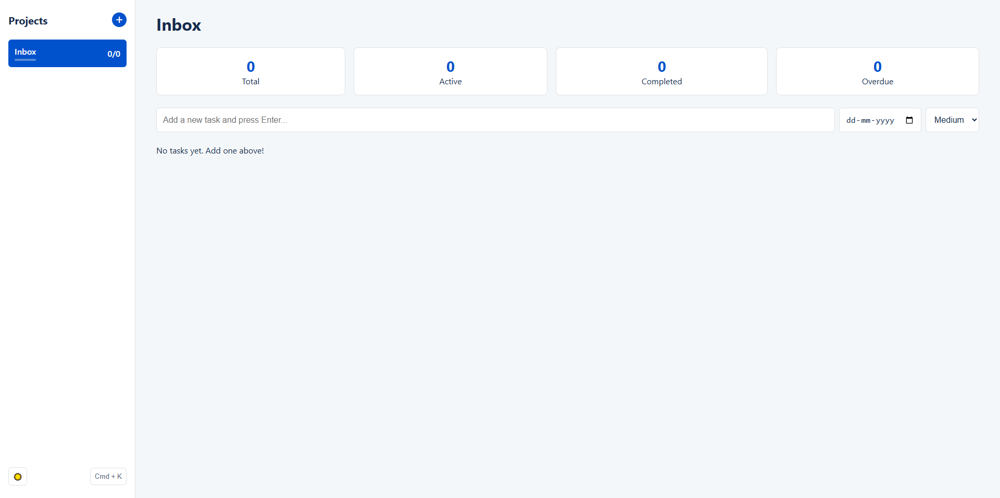

# Todo Web App | A Modern Task & Project Manager

[](https://aakhalidhruv28.github.io/To-Do-List-Web-App/)


A feature-rich, modern to-do list and project management web application built with pure HTML, CSS, and JavaScript. This app goes beyond a simple checklist, offering a suite of productivity tools designed for a seamless and intuitive user experience.

### ✨ [**Click Me For Live Demo**](https://aakhalidhruv28.github.io/To-Do-List-Web-App/) ✨


*(Note: It's highly recommended to create a `screenshot.png` or an animated `demo.gif` of your app and place it in the project's root directory to replace this placeholder image.)*

## About The Project

This project was built to demonstrate a complete, client-side productivity application without any external frameworks or libraries. It leverages the power of modern browser APIs (`localStorage`) and advanced CSS/JS to create a fast, responsive, and delightful experience. The goal was to create not just a to-do list, but a genuine productivity hub that helps users organize their work and focus on what matters.

## Key Features

### ✅ Project & Task Management
*   **Project Organization:** Group your tasks into distinct projects or categories.
*   **CRUD for Tasks:** Add, edit, and delete tasks with ease.
*   **Task Notes:** Add detailed notes or descriptions to any task.
*   **Due Dates:** Set and track due dates with visual indicators for overdue tasks.
*   **Priority Levels:** Assign Low, Medium, or High priority to tasks, color-coded for quick identification.
*   **Project Progress:** See an at-a-glance progress bar for each project.

### 🚀 Power-User Tools
*   **Command Palette:** Use `Ctrl+K` (or `Cmd+K`) to open a command palette. Instantly search for any task across all projects or execute commands like "Toggle Theme" or "Add New Task".
*   **Focus Mode:** Start a 25-minute Pomodoro-style focus session on any task to eliminate distractions and boost productivity. The task is automatically marked as complete when the timer finishes.
*   **Confirmation Modals:** Prevents accidental deletion of entire projects with a confirmation step.

### 🎨 Design & UX
*   **Modern UI:** A clean, two-column layout that's intuitive and easy to navigate.
*   **Dark/Light Theme:** Seamlessly toggle between dark and light modes. Your preference is saved locally.
*   **Responsive Design:** Flawless performance on desktop, tablet, and mobile devices.
*   **Smooth Animations:** Subtle, satisfying animations for adding tasks and interacting with the UI.
*   **Smart Statistics:** Live counters for total, active, completed, and overdue tasks for the current project.

## Tech Stack

This project is built with web fundamentals, demonstrating strong core skills without reliance on frameworks.

*   
*   
*   
*   **Browser `localStorage` API** for persistent, client-side data storage.

## Getting Started

To run this project locally, follow these simple steps.

1.  Clone the repository:
    ```sh
    git clone https://github.com/aakhalidhruv28/To-Do-List-Web-App.git
    ```
2.  Navigate to the project directory:
    ```sh
    cd To-Do-List-Web-App
    ```
3.  Open `index.html` in your favorite web browser.

That's it! No build steps or dependencies required.

## How to Use

*   **Add a Project:** Click the `+` button in the sidebar.
*   **Switch Projects:** Click on any project name in the sidebar.
*   **Add a Task:** Type in the input field at the top of the main view and press `Enter`.
*   **Edit a Task/Note:** Click directly on the task text or note area to start editing. Click away to save.
*   **Open Command Palette:** Press `Ctrl+K` or `Cmd+K`.
*   **Start Focus Mode:** Click the `🎯` icon on any task.

## Future Improvements

This project has a solid foundation. Future features could include:
*   [ ] Backend integration with a service like Firebase or Supabase for cloud sync.
*   [ ] User authentication to allow for private, account-based lists.
*   [ ] Drag-and-drop reordering of tasks.
*   [ ] A dedicated Calendar view for tasks with due dates.
*   [ ] Collaboration features to share projects with other users.

## License

Distributed under the MIT License. See `LICENSE` for more information.

---
